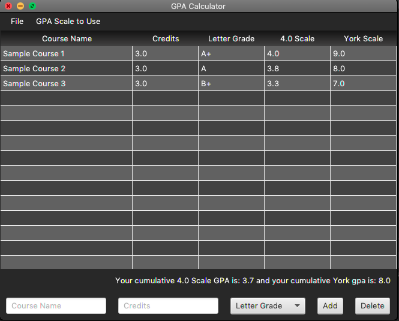
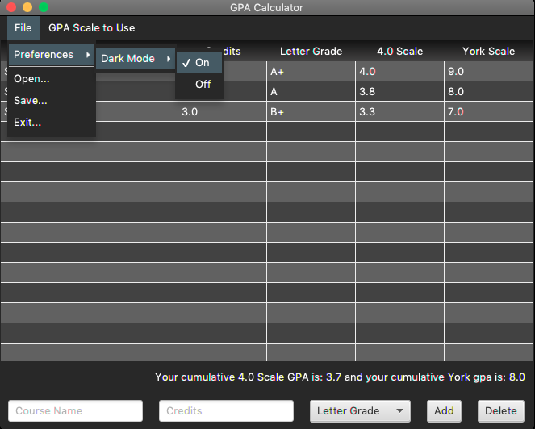
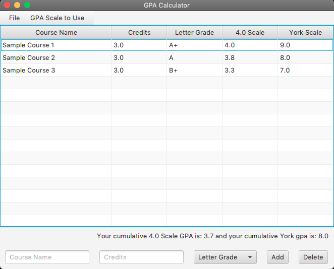
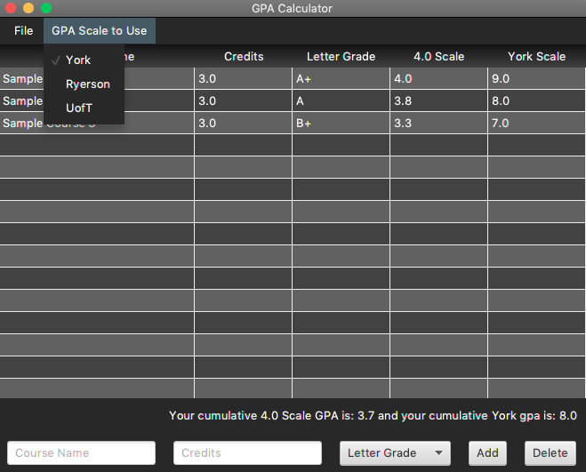
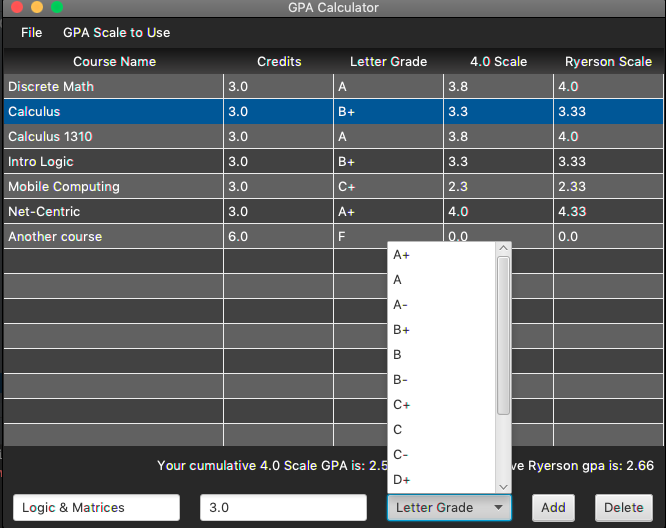
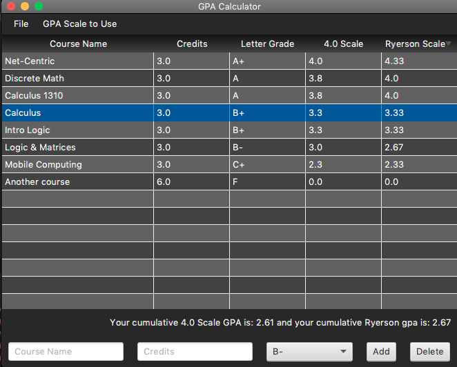

# GPA Calculator

## Description

> Using the GPA calculator in this project you are able to quickly convert letter grades from courses to various different GPA grading scales. You also have the option to view your cumulative GPA for these different scales, as well as save your current table data as a ``csv`` file and open it at a future time.

> Currently it natively supports standard 4.0 scale, as well as York University 9.0 scale, Ryerson 4.33 scale, and UofT's 4.0 scale.

## Installation

### Prerequisites 
- ** Java 11 minimum is required** - [Oracle Java SE Downloads](https://www.oracle.com/java/technologies/javase-jdk11-doc-downloads.html)
- **Maven is required** - [Maven Apache Download] (https://maven.apache.org/download.cgi)
    - Here is a good [guide] (https://www.baeldung.com/install-maven-on-windows-linux-mac) from Baeldung for installation.
    - Another option through Homebrew is:
        - ``brew update``
        - ``brew install maven`` 
        - ``mvn version``

Once the prerequisites have been met, simply clone the repository or download it as a ``zip`` file from the button above. Import the project into your IDE as a Maven project and run the main method (``App.java``) to start the program. [Here] (https://www.youtube.com/watch?v=iWfIR2nc69A) is a quick YouTube video that runs through importing a project in IntelliJ. If you encounter any errors, rebuild the project first and try again.

Note the project comes with a Maven launch plugin that creates a ``launch.sh`` script in the target folder that can be used to launch the project through the terminal once it's been build. However this will only work in unix systems, and you will need to tweak the launch file/plugin to work in Windows.

## Usage
On initial open the application table will come in with three dummy items added, these can be deleted by selecting the rows and hitting the delete button.

Under the File menu, you will find preferences, open, save and exit. Selecting open or save will take you to your OS file managing system where you can select the appropriate file and/or destination. By default the application comes with dark mode enabled.

However, this can be turned off in the preferences.

Under the GPA Scale to Use menu you can select the appropriate alternative scale to use. It will display the alternative scale in column 5, and column 4 will always be the standard 4.0 scale for reference. You will also be able to see your cumulative GPA for the standard 4.0 scale and alternative scale below the table.

Courses can be added through the bottom toolbar, where you will provide the course name, the credits/weight of the course and select the appropriate letter grade from the dropdown.

You also have the option to sort the table by each heading column, to see courses or letter grades sorted alphabetically, and credits or scales to be sorted numerically.

## License
Open source under terms of MIT license.